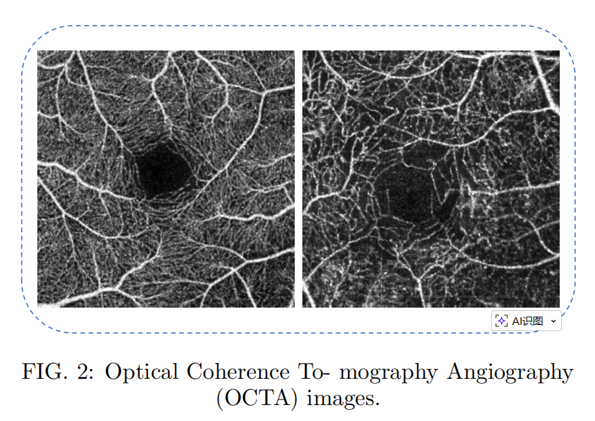
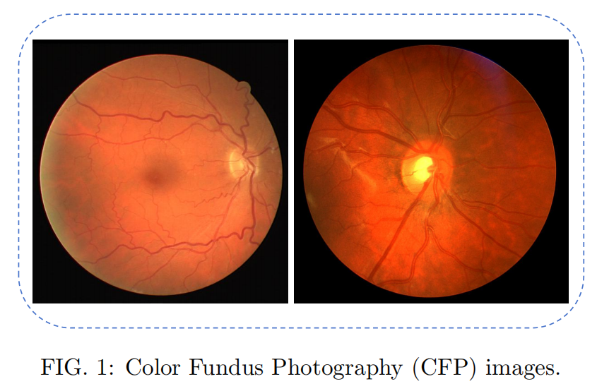
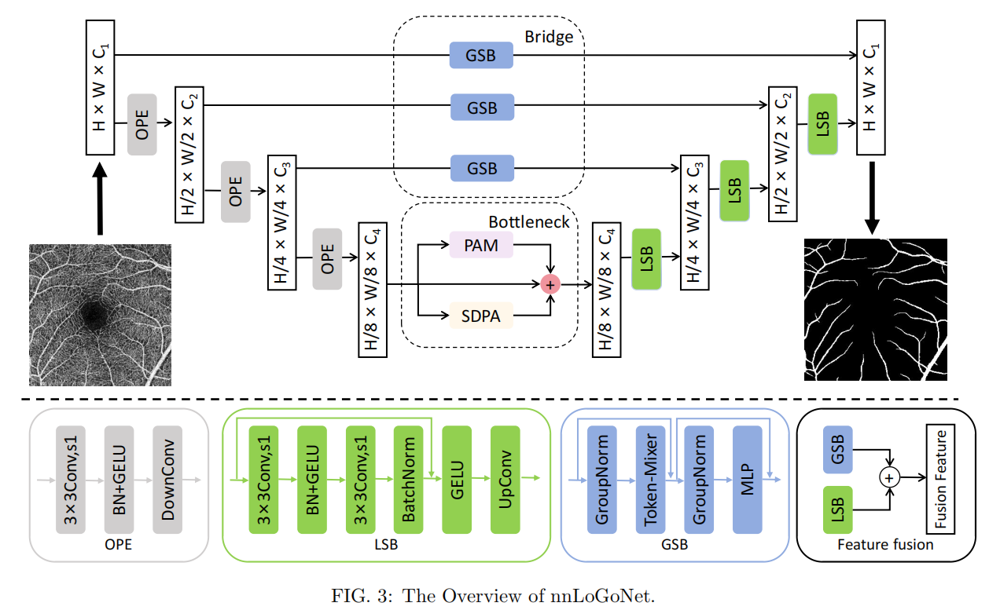
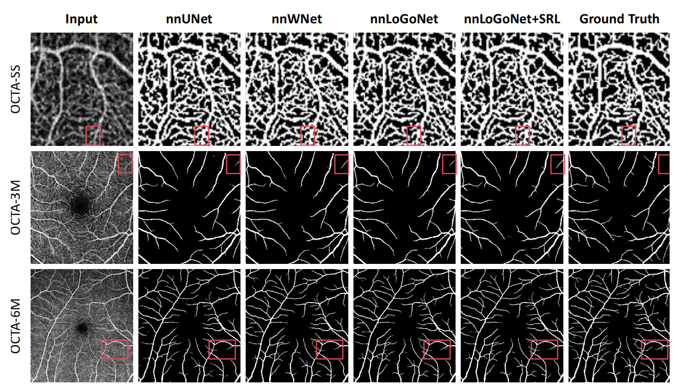
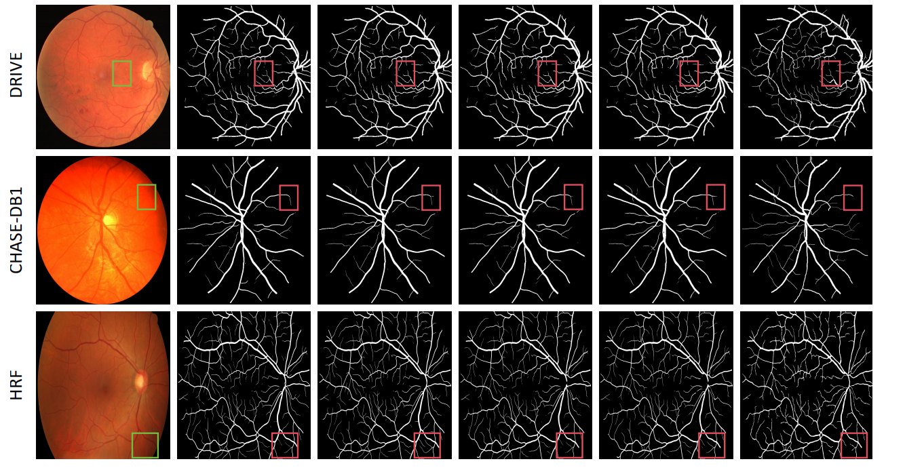

# nnLoGoNet: Retinal Vessel Segmentation via Local-Global Feature Fusion and Skeleton Recall Loss

This is the official code of [nnLoGoNet: Retinal Vessel Segmentation via Local-Global Feature Fusion and Skeleton Recall Loss](https://).

## How to Use
- Download and configure [**nnUNet**](https://github.com/MIC-DKFZ/nnUNet)

- Move **nnUNetTrainer_LoGoNet.py** to **.../nnUNet/nnunetv2/training/nnUNetTrainer/** of the configured nnUNet

- Use nnLoGoNet just like nnUNet:
  
- Other necessary files you can find on our repo.
## Download datasets
### 📊 Dataset Overview

The experiments are conducted on both Optical Coherence Tomography Angiography (OCTA) and Color Fundus Photography (CFP) datasets. The details are summarized in the table below:

| Dataset | Train & Val | Test | Image Size (Pixels) | Characteristics / Purpose |
| :--- | :---: | :---: | :---: | :--- |
| **OCTA-SS** | 44 | 11 | $91 \times 91$ | Small sample size; validates feature extraction in few-shot scenarios. |
| **OCTA-3M** | 160 | 40 | $304 \times 304$ | Clearer capillary details; high-definition microvasculature. |
| **OCTA-6M** | 240 | 60 | $400 \times 400$ | Large Field of View (FOV); complex branching & background noise. |
| **DRIVE** | 20 | 20 | $565 \times 584$ | General benchmark; includes various clinical pathologies. |
| **CHASE-DB1** | 20 | 8 | $999 \times 960$ | Images from children; ensures demographic robustness of the model. |
| **HRF** | 25 | 20 | $3504 \times 2336$ | High-resolution; includes healthy, DR, and glaucoma subjects. |


You can first download [DRIVE](https://www.kaggle.com/datasets/andrewmvd/drive-digital-retinal-images-for-vessel-extraction) for quick check.

All datasets as follows:
1. [OCTA-SS](https://datashare.ed.ac.uk/handle/10283/3528)
2. [OCTA-500(OCTA-3M/6M)](https://ieee-dataport.org/open-access/octa-500)
3. [DRIVE](https://www.kaggle.com/datasets/andrewmvd/drive-digital-retinal-images-for-vessel-extraction)
4. [CHASE-DB1](https://www.kaggle.com/datasets/khoongweihao/chasedb1)
5. [HRF](https://www5.cs.fau.de/research/data/fundus-images/)


> Data Preprocessing
```
nnUNetv2_plan_and_preprocess -d 11 --verify_dataset_integrity
```

> Training
```
CUDA_VISIBLE_DEVICES=0 nnUNetv2_train 11 2d 0 -tr nnUNetTrainer_LoGoNet
CUDA_VISIBLE_DEVICES=1 nnUNetv2_train 11 2d 1 -tr nnUNetTrainer_LoGoNet
CUDA_VISIBLE_DEVICES=2 nnUNetv2_train 11 2d 2 -tr nnUNetTrainer_LoGoNet
CUDA_VISIBLE_DEVICES=3 nnUNetv2_train 11 2d 3 -tr nnUNetTrainer_LoGoNet
CUDA_VISIBLE_DEVICES=4 nnUNetv2_train 11 2d 4 -tr nnUNetTrainer_LoGoNet
```

> Continue Training
```
CUDA_VISIBLE_DEVICES=0 nnUNetv2_train 11 2d 0 -tr nnUNetTrainer_LoGoNet --c
```

> Best Configuration
```
nnUNetv2_find_best_configuration 11 -c 2d -tr nnUNetTrainer_LoGoNet
```

> Testing
```
nnUNetv2_predict -i .../nnUNetFrame/nnUNet_raw/Dataset11_your_dataset/imagesTs/ -o .../your_predict_path/ -d 11 -c 2d -tr nnUNetTrainer_LoGoNet
```


## Datasets Images
> Optical Coherence To- mography Angiography(OCTA) images.   

> Color Fundus Photography (CFP) images.



## The Overview of nnLoGoNet.



## Quantitative Comparison




## Qualitative Comparison
The following tables summarize the segmentation performance of **nnLoGoNet** compared with state-of-the-art methods across three benchmark datasets.

### 1. Results on DRIVE Dataset
| Model | Acc(%)↑ | AUC(%)↑ | Dice(%)↑ | MCC(%)↑ | HD95↓ |
| :--- | :---: | :---: | :---: | :---: | :---: |
| UNet | 94.87 | 96.99 | 80.00 | 77.06 | 37.96 |
| Attention UNet | 95.42 | **98.04** | 82.32 | 79.74 | 20.03 |
| ResUNet++ | 94.94 | 97.12 | 80.18 | 77.28 | 37.75 |
| SA-UNet | 95.44 | 97.95 | 82.42 | 79.82 | 20.84 |
| ConvUNeXt | 95.46 | 97.76 | 82.31 | 79.71 | 79.71 |
| MSDANet | 95.48 | 97.85 | <u>82.43</u> | <u>79.84</u> | 27.43 |
| DSAE-Net | 95.48 | <u>98.00</u> | **82.44** | **79.86** | 12.12 |
| nnUNet (baseline) | 95.50 | 96.34 | 81.09 | 78.84 | 11.79 |
| nnWNet (2025) | **95.54** | 97.59 | 81.38 | 79.15 | <u>10.80</u> |
| **nnLoGoNet (Ours)** | <u>95.52</u> | 97.27 | 81.64 | 79.30 | **10.36** |

### 2. Results on CHASE-DB1 Dataset
| Model | Acc(%)↑ | AUC(%)↑ | Dice(%)↑ | MCC(%)↑ | HD95↓ |
| :--- | :---: | :---: | :---: | :---: | :---: |
| UNet | 95.89 | 97.99 | 79.11 | 76.88 | 64.42 |
| Attention UNet | 96.22 | 98.45 | 81.22 | 79.27 | 34.74 |
| ResUNet++ | 96.25 | 98.48 | 81.29 | 79.33 | 26.25 |
| SA-UNet | 96.14 | 98.52 | 80.99 | 78.02 | 35.59 |
| DSAE-Net | 96.25 | 98.56 | 81.46 | 79.54 | 22.65 |
| nnUNet (baseline) | 96.55 | 95.86 | 81.85 | 80.00 | **11.54** |
| nnWNet (2025) | **96.65** | **98.68** | **82.21** | **80.41** | <u>11.70</u> |
| **nnLoGoNet (Ours)** | <u>96.58</u> | <u>98.66</u> | <u>81.95</u> | <u>80.13</u> | 12.09 |

### 3. Results on HRF Dataset
| Model | Acc(%)↑ | AUC(%)↑ | Dice(%)↑ | MCC(%)↑ | HD95↓ |
| :--- | :---: | :---: | :---: | :---: | :---: |
| UNet | 96.11 | 97.44 | 78.79 | 76.65 | 170.60 |
| Attention UNet | 96.37 | 98.01 | 80.46 | 78.46 | 127.14 |
| SA-UNet | 96.29 | 97.94 | 80.10 | 78.06 | 128.25 |
| DSAE-Net | 96.31 | 97.90 | 80.12 | 78.10 | 126.25 |
| nnUNet (baseline) | 96.62 | 98.68 | 81.44 | 79.71 | **22.16** |
| nnWNet (2025) | <u>96.70</u> | **98.76** | <u>81.85</u> | <u>80.15</u> | <u>24.97</u> |
| **nnLoGoNet (Ours)** | **96.75** | <u>98.74</u> | **81.89** | **80.22** | 25.86 |

### 📊 Quantitative Results on OCTA Datasets

Comparison of **Dice** and **Jaccard (JAC)** scores across three OCTA sub-datasets. **Bold** indicates the best performance, and <u>Underline</u> indicates the second-best.

#### 1. OCTA-SS Dataset (Small Sample Size)
| Methods | Dice (%) | JAC (%) |
| :--- | :---: | :---: |
| U-Net | 89.00 ± 0.00 | - |
| SCS-Net | 90.10 ± 1.36 | 82.01 ± 2.26 |
| nnUNet (baseline) | 89.59 ± 1.17 | 81.16 ± 1.92 |
| nnWNet (2025) | 90.22 ± 1.19 | <u>82.21 ± 1.97</u> |
| **nnLoGoNet (Ours)** | **90.36 ± 1.18** | **82.43 ± 1.96** |
| **nnLoGoNet + SRLoss (Ours)** | <u>90.26 ± 1.16</u> | 82.27 ± 1.94 |

#### 2. OCTA-3M Dataset (High-Definition)
| Methods | Dice (%) | JAC (%) |
| :--- | :---: | :---: |
| U-Net | 90.60 ± 2.16 | 82.88 ± 3.47 |
| UTNet | 91.12 ± 2.11 | 83.76 ± 2.44 |
| nnUNet (baseline) | 91.58 ± 1.58 | 84.51 ± 2.59 |
| nnWNet (2025) | <u>92.06 ± 1.59</u> | <u>85.32 ± 2.60</u> |
| **nnLoGoNet (Ours)** | 91.99 ± 1.61 | 85.21 ± 2.26 |
| **nnLoGoNet + SRLoss (Ours)** | **92.16 ± 1.59** | **85.50 ± 2.62** |

#### 3. OCTA-6M Dataset (Large FOV)
| Methods | Dice (%) | JAC (%) |
| :--- | :---: | :---: |
| CS-Net | 89.01 ± 2.49 | 80.24 ± 3.81 |
| UTNet | 91.08 ± 2.53 | 80.41 ± 1.51 |
| nnWNet (2025) | <u>88.89 ± 2.33</u> | <u>80.08 ± 3.59</u> |
| **nnLoGoNet (Ours)** | **89.06 ± 2.23** | **80.35 ± 3.61** |
| **nnLoGoNet + SRLoss (Ours)** | 88.88 ± 2.40 | 80.07 ± 3.70 |

## Citation
>If our work is useful for your research, please cite our paper:
```
```
